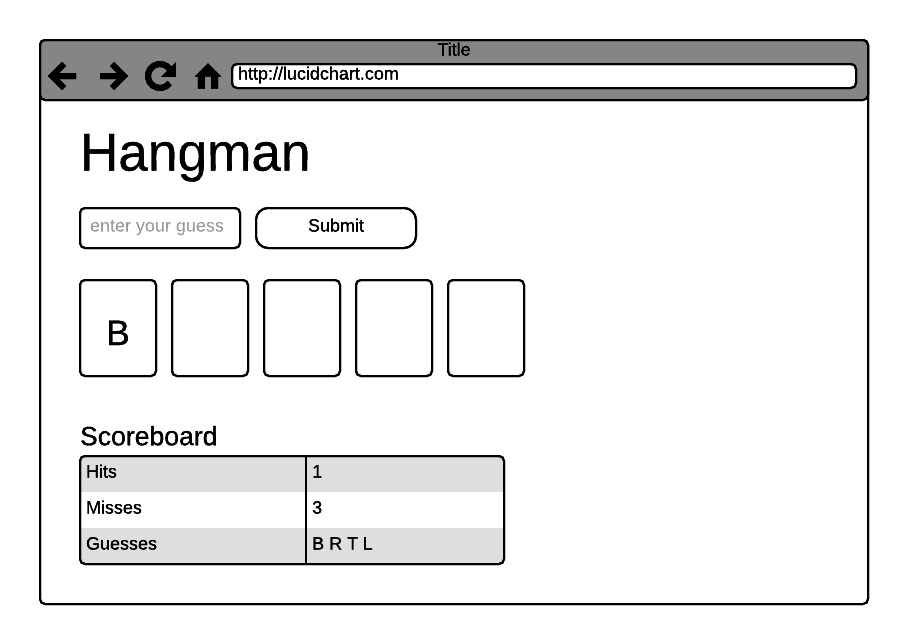

# js-hangman

This repo provides an exercise for front-end candidates at Bazaarvoice.

## Prerequisites

The contents of this repo should be available on your computer
when the session begins. You will also need to have Node installed.

You will need the Grunt command line tools  in order to run this application:
`npm install -g grunt-cli`.

You will also need to run `npm install` from the root directory, and then ensure that `grunt serve` runs without error and opens the dev server test page, showing "Hello world." on the screen.

## The exercise

The exercise involves building a game of Hangman -- a simple letter-guessing
game -- that can be played in the browser. A complete implementation would
include a user interface that:

- Queries a server endpoint (http://localhost:3000/word) for the word to be
  guessed
- Displays "blanks" for each letter of the word to be guessed
- Provides a mechanism for a user to make a guess
- Validates the user's guess, ensuring that a) it is a letter, and b) it is a
  letter that has not been guessed before
- For an invalid guess, provides the user with feedback
- For an incorrect guess, increments a "miss" counter
- For a correct guess, populates the appropriate "blanks"
- Indicates that the user has lost after 7 incorrect guesses
- Indicates that the user has won if all blanks are populated

You can use the following as guidance for the user interface:

The exercise takes place in three parts, as described below.

### Part 1: Overview

The interviewer will provide a brief overview of the system that will
be used for the exercise, notably:

- The server can be started by running `grunt serve`. This will compile the
  CSS and JS, start the development server, and open the development server
  page in a browser. As you make changes, the development server page will
  live-reload.
- The server/index.js file provides an Express server. This server is
  responsible for serving static files from the .build/ directory, and for
  hosting an endpoint that provides a random word to be guessed.
- The static/ directory contains subdirectories for HTML, CSS, and JS.
- CSS is compiled using [Sass](http://sass-lang.com/). This allows you to use
  modules if you would like, but you can also simply write your CSS in
  static/styles/main.scss.
- JS is written using CommonJS-style modules and compiled using
  [webpack](http://webpack.github.io/). This allows you to use modules if you
  would like, but you can also simply write your JS in static/js/main.js.
- JS is linted using very basic [ESLint](http://eslint.org/) rules; you can
  test your code by running `grunt eslint`.
- You can add resources such as jQuery, Underscore, etc. as desired.

You should work with the interviewer for no more than 30 minutes
to discuss the problem and any questions they have. The interviewer will
continue to be available to answer more questions as they arise.

### Part 2: Development

You and the interviewer should agree on a start time and an end time; in the
intervening time, you should spend as much time as you'd like on the
exercise. The interviewer will be available via email if you have questions.

### Part 3: Discussion

You and the interviewer should meet to discuss your work. **It is OK if you do
not arrive at a complete solution.** In this discussion, the interviewer will be
looking for evidence that you understood the problem and that a solution would
be attainable within a reasonable period of time.
